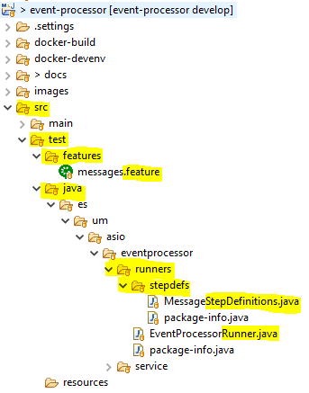
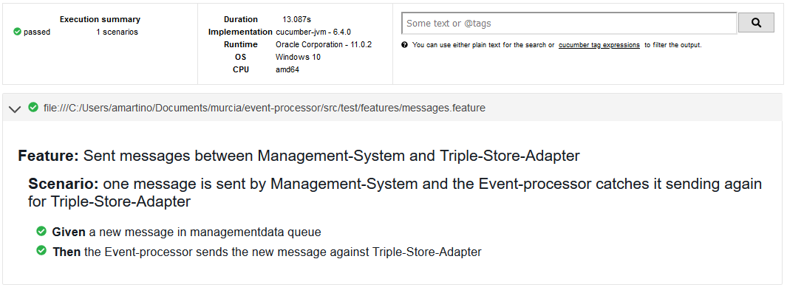
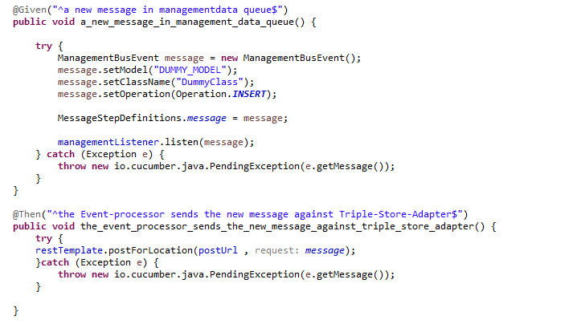

# Testing BDD con Cucumber

## Configuración del entorno

### Plugins

Se precisa instalar el [plugin cucumber](http://cucumber.github.com/cucumber-eclipse/update-site) para eclipse.


### Dependencias de Maven

Se añaden las dependencias de cucumber en el _pom.xml_ version `6.4.0` con el scope `test`.

```xml
        <dependency>
            <groupId>io.cucumber</groupId>
            <artifactId>cucumber-java</artifactId>
            <version>${cucumber.version}</version>
            <scope>test</scope>
        </dependency>

        <dependency>
            <groupId>io.cucumber</groupId>
            <artifactId>cucumber-junit</artifactId>
            <version>${cucumber.version}</version>
            <scope>test</scope>
        </dependency>

        <dependency>
            <groupId>io.cucumber</groupId>
            <artifactId>cucumber-spring</artifactId>
            <version>${cucumber.version}</version>
            <scope>test</scope>
        </dependency>
        <dependency>
            <groupId>net.masterthought</groupId>
            <artifactId>cucumber-reporting</artifactId>
            <version>${cucumber.version}</version>
            <scope>test</scope>
        </dependency>
```

Una vez instalado el plugin y configuradas las dependencias de maven, para ejecutar las pruebas se necesita ejecutar la instrucción de maven:

```
mvn test
```

## Como crear un test BDD

### Estructura de carpetas

```
proyecto
  src
    test
      features
        (ficheros del tipo *.feature)
      java
        ..
          runners
            (ficheros del tipo *Runner.java)
            stepdefs
              (ficheros del tipo *StepDefinitions.java)
```

Ejemplo:



### Implementación de las pruebas

### Runners

Se precisa al menos definir como mínimo un Runner para ejecutar las pruebas. Dentro de la anotación `@CucumberOptions` es necesario definir los siguientes parámetros obligatorios:

- **features**: Ruta donde se encuentran definidos los escenarios a probar.
- **glue**: Hubicación del código que implementa los escenarios definidos en features

Opcional:

- **plugin**: Se define el formato de salida, con el resultados de los tests.

Ejemplo:

```java
@RunWith(Cucumber.class)
@CucumberOptions(
		plugin = {"pretty", "html:target/cucumber", "summary"},
		features = {"src/test/features"},
		glue = {"es.um.asio.eventprocessor.runners.stepdefs"}
		)
public class EventProcessorRunner {
}
```

Ejemplo resultado ejecución:



### Escenarios

Es posible implementar los test usando @SpringBootTest si la aplicación es de tipo backend sin vista, o utilizando selenium para partes web donde se precisa la navegación por parte del usuario.

#### Testing backend

```java
@CucumberContextConfiguration
@RunWith(SpringRunner.class)
@SpringBootTest(webEnvironment = SpringBootTest.WebEnvironment.DEFINED_PORT, classes = {
		MessageStepDefinitions.MessageServiceConfiguration.class })
public class MessageStepDefinitions {
```



**IMPORTANTE**: A la hora de implementar los tests los parámetros dentro de `@Given` y `@Then` tienen que coincidir con la información descrita dentro del fichero .feature ya que se trata de una expresión regular `. description escenario $`

#### Testing web

```java
WebElement myAccountLink = driver.findElement(By.className("account_icon"));
myAccountLink.click();
```

## Escenarios

A continuación se describen los escenarios probados, utilizando el framework [Cucumber](https://cucumber.io/docs/cucumber/)

| Feature                                                               | Descripción                                                                                                                                          |
| --------------------------------------------------------------------- | ---------------------------------------------------------------------------------------------------------------------------------------------------- |
| [`messages.feature`](../src/test/features/messages.feature)           | Pruebas sobre la recepción de mensajes procedentes de la cola kafka **management-data** y posterior envío al controller del **triple-store-adapter** |
| [`pojo-etl.feature`](../src/test/features/pojo-etl.feature)           | Pruebas sobre la generación de RDF procedentes de **ETL**                                                                                            |
| [`pojo-xml.feature`](../src/test/features/pojo-xml.feature)           | Pruebas sobre la generación de RDF procedentes de ficheros importados **xml**                                                                        |
| [`multilanguage.feature`](../src/test/features/multilanguage.feature) | Pruebas sobre la generación de RDF en distintos lenguajes                                                                                            |
